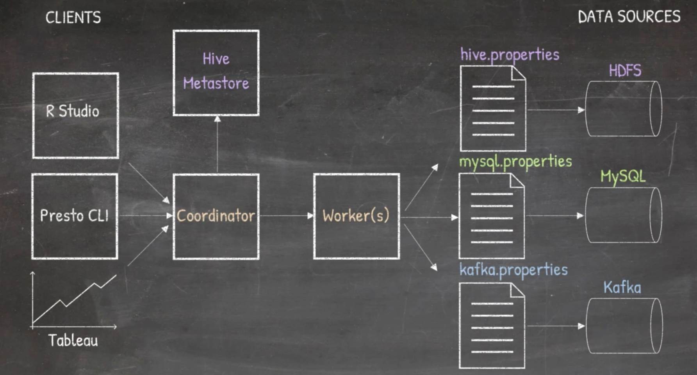

## Presto Architecture ##
All about mastery of Presto.

### Overview ###
1. The following diagram illustrates a fictituous but real-world data scenario that Presto can help to solve really well:
  

1. Designed by FB in 2012; open-sourced to Apache Foundation in 2013.

1. Presto is a distributed interactive query engine that can query data where it is stored and supports:
- HDFS, MySQL, Kafka, NoSQL, Data Warehouses, Object/Blob stores;
- Separates compute and storage to scale them independently;
- SQL queries on Petabyte scale data in seconds!
- Presto supports different types of clients to pull data (R Studio, Tableau, CLI), can combine and process data from different types of storage (HDFS, MySQL, Kafka etc).

### Architectural Design ###
1. `Coordinator` is the linchpin and vital component of Presto.

1. `Workers` are the other important component that does the work.

1. `Presto CLI` (one of the many supported Presto clients) allows SQL queries to be issued to Presto.

1. Clients send commands to the `Coordinator` which will parse and derive a query plan, which will be executed by the `workers`. After the execution `coordinator` extracts the results from the `workers` and returns it to the client who made the call.

1. `Workers` register themselves with the `Discover Service` which will allow the `coordinator` to communicate with the workers. All communications between clients --> `Coordinator` --> `Workers` are done through REST APIs.

1. Typically you will have `Coordinator` and `Workers` on different nodes.

1. If data store is HDFS, we will also need a `Hive Metastore`; other types of data stores do not need this. Each different data store has its own `.properties` file in the **catalog** folder.

1. Architecture diagram:  

---
