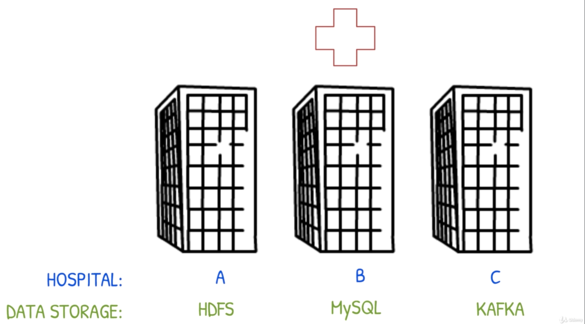

## Presto Architecture ##
All about mastery of Presto.

### Overview ###
1. The following diagram illustrates a fictituous but real-world data scenario that Presto can help to solve really well:
  

1. Designed by FB in 2012; open-sourced to Apache Foundation in 2013.

1. Presto is a distributed interactive query engine that can query data where it is stored and supports:
- HDFS, MySQL, Kafka, NoSQL, Data Warehouses, Object/Blob stores;
- Separates compute and storage to scale them independently;
- SQL queries on Petabyte scale data in seconds!
- Presto supports different types of clients to pull data (R Studio, Tableau, CLI), can combine and process data from different types of storage (HDFS, MySQL, Kafka etc).

### Architectural Design ###
1. `Coordinator` is the linchpin and vital component of Presto.

1. 