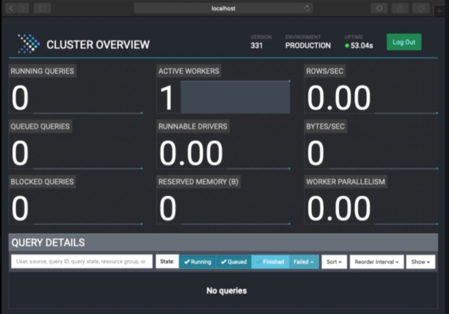

## Installation of different Presto clients ##
This page contains an overview of three Presto clients and their setup instructions.
We will be exploring **Presto CLI**, **RStudio**, **Tableau** and **Presto Web UI**.

### Presto CLI ###
1. Using Presto CLI 331.

1. Go to https://trino.io/docs/current/installation/cli.html and download the jar for the CLI client.

1. After downloading, you may need to execute `chmod` command to make sure you can execute the downloaded jar as the Presto CLI is a self executing jar file.

1. Execute the jar on the command prompt by invoking `./presto-cli-331-executable.jar --server [url:port]` where the URL and port will be the value found in `etc/config.properties` file under `discovery.uri` property.

1. Successful launch of CLI will return `presto>` shell prompt. And you can run commands such as `show catalogs`, `show schemas from system`, `show tables from system.information_schema` etc.

### RStudio ###
1. You will need `R` before RStudio can work. Download `R` from https://wwww.r-project.org (https://repo.bppt.go.id/cran/) and select the OS that is supported for your environment.  
`R-4.1.0` is latest as of Jul 2021.

1. Download RStudio from https://www.rstudio.com and select RStudio Desktop and install.

1. Consider changing Preferences/Settings --> Appearance for dark theme version.

1. You will need to write R code to connect RStudio to Presto and run it as a R Script from the studio IDE. The code shall also take care of downloading needed R packages as the 1st step.

1. The connection portion of the code is as follows:
```
connection <-dbConnect(RPresto::Presto()
    host='http://localhost',
    port=8080,
    user='teacher'
    schema='<Name of a Presto schema>'
    catalog='system'
)
```
Note the **host** and **port** will be the same value as the one we saw from `etc/config.properties` file under `discovery.uri` property.

You can find the full script [here.](./scripts/RStudio_Script.csv)

### Tableau ###
1. Go to https://tableau.com, Products tab and download **Tableau Desktop** as a free *trial* version.

1. **Tableau Desktop** natively supports querying from Presto. Bring up the settings page and enter the same host:port informtion `discovery.uri` property, in the **Server** field.

1. Install the Presto driver by downloding & installing it from the setup dialog page. This will take you to `prestodb.io` site though and we download the JDBC driver for Presto.

1. Copy the downloaded driver jar file to `~/Library/Tableau/Drivers` (on MacOS).

1. Restart RStudio for the driver to take effect and complete the setup for the connection information.

1. Once connected use RStudio GUI to execute Presto queries through point and click.

### Presto Web UI ###
1. A web based interface for managing and monitoring Presto queries.

1. Start the Preso server and point your browser to the host:port. If you have done a local installation, this would be `localhost:8080`. Login using **test** with no password if you had not yet setup and authorization.

1. First page of the web UI will be the **Cluster Overview** page showing number of running queries, active workers etc:  


1. You will see under **Query Details** different connected clients (CLI, Tableau and RStudio etc) with their own connected username and source of the type of client, as well as the queries they have executed or are running.

1. You can also analyze the individual queries sessions to see the splits and execution plan of the query.
---